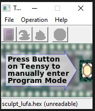
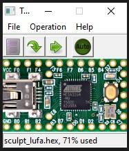
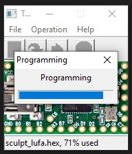

### Materials
* Soldering iron / solder / flux
* Teensy 2.0 board
* Maartens custom sculpt PCB board
* 30 pin ribbon connector

### Part 1: Building the pcb board
* **Attaching the 30 min connector**
  * Place a little bit of solder on the two header pads on the pcb
  * Take the 30 pin ribbon connector and align the tiny soldering pads. Place it so a little bit of the solder pad is exposed behind the connector. 
  * Tape it to the pcb board so it doesn’t slider around
  * You will melt the solder on the pad from behind the connector and quickly push/slide it into place so that it is place directly above the pad. DO NOT hold it too long or you will burn yourself like i did.
  * Do the same with the other side.
* **Soldering the teensy board**
  * I found the easiest way to solder in the teensy board was to use wires (legs of resistors in my case) and solder from above and below, this guarantees connectivity of the pads. Others have placed solder directly on the via’s and let it flow through through the openings,but if solder doesn’t bridge the teensy and the pcb it will be difficult to diagnose. 
  * Put the wire through the hole and bend at a 90 degree angle. Solder top and bottom and continue to the next holes until all the vias are filled.

### Part 2: Programming the teensy 2.0

* Plug in the keyboard with the new pcb board to the pc.
* Launch the executable
* Drag and drop the hex file into the teensy gui
* Press the program button
* Unplug and replug the keyboard to the computer 

====

Teensy programming executable

Teensy ready to be programmed(green down arrow)

Teensy in programming mode

---
#### Tips 
With TMK/QMK firmware you can hold Space+B while plugging in the keyboard and the Teensy will load into the bootloader for flashing. It's very handy if you need to reflash the firmware because you don't have to open the keyboard to press the button on the Teensy.

#### More Resources

[TMK github page on Microsoft Sculpt](https://github.com/blttll/tmk_keyboard/tree/master/keyboard/sculpt)
